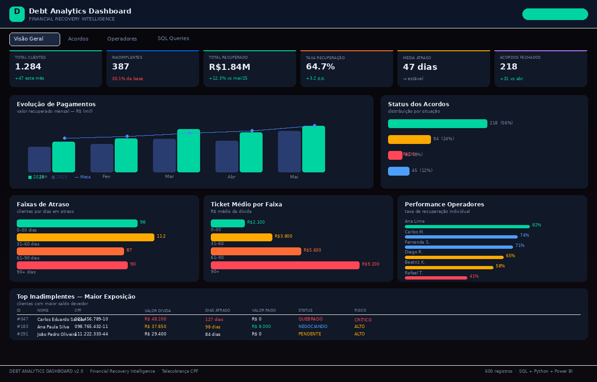

# 📊 Dashboard de Análise de Dados em Telecobrança

Dashboard de cobrança e inadimplência com dados de clientes CPF.  
Desenvolvido para análise de performance, faixas de atraso e recuperação financeira.



---

## 📁 Arquivos do Projeto

| Arquivo | O que é |
|---|---|
| `cobranca_dados.csv` | Base principal — 600 clientes CPF com dívidas, status e pagamentos |
| `queries.sql` | 6 consultas SQL prontas para análise |
| `gerar_dados.py` | Script Python para gerar novos dados |
| `dashboard_preview.png` | Preview do dashboard |

---

## 🗂️ Estrutura da Base de Dados

| Coluna | Descrição | Exemplo |
|---|---|---|
| ID | Código do cliente | 1 |
| Nome | Nome completo | Ana Paula Silva |
| CPF | CPF formatado | 000.000.001-91 |
| Telefone | Para contato | (81) 94657-3286 |
| Valor_Divida | Valor total da dívida | 1017.27 |
| Dias_Atraso | Dias em atraso | 45 |
| Faixa_Atraso | Grupo de atraso | 31-60 dias |
| Status | Situação do cliente | PAGO / PENDENTE / QUEBRADO / NEGOCIANDO / EM ATRASO |
| Valor_Pago | Quanto já pagou | 500.00 |
| Operador | Cobrador responsável | Ana Lima |
| Data_Vencimento | Data do vencimento | 15/03/2025 |
| Data_Pagamento | Data do pagamento (se pago) | 20/03/2025 |

---

## 📊 Como usar no Power BI — Passo a Passo

### 1. Importar o CSV
1. Abra o Power BI Desktop
2. Clique em **Obter Dados → Texto/CSV**
3. Selecione o arquivo `cobranca_dados.csv`
4. **Delimitador:** ponto e vírgula ( `;` )
5. Clique em **Carregar**

### 2. KPIs — Medidas DAX (cole no campo de medidas)

```dax
-- Total de Clientes
Total Clientes = COUNTROWS(cobranca_dados)

-- Inadimplentes
Inadimplentes = CALCULATE(COUNTROWS(cobranca_dados), cobranca_dados[Status] <> "PAGO")

-- Total Recuperado
Total Recuperado = SUM(cobranca_dados[Valor_Pago])

-- Taxa de Recuperação
Taxa Recuperacao = DIVIDE(SUM(cobranca_dados[Valor_Pago]), SUM(cobranca_dados[Valor_Divida])) * 100

-- Média de Atraso
Media Atraso = CALCULATE(AVERAGE(cobranca_dados[Dias_Atraso]), cobranca_dados[Status] <> "PAGO")

-- Acordos Fechados
Acordos Fechados = CALCULATE(COUNTROWS(cobranca_dados), cobranca_dados[Status] IN {"PAGO", "NEGOCIANDO"})
```

### 3. Visuais sugeridos

| Visual | Campo | Onde usar |
|---|---|---|
| Cartão | Total Clientes | KPI topo |
| Cartão | Total Recuperado | KPI topo |
| Cartão | Taxa Recuperacao | KPI topo |
| Gráfico de barras | Faixa_Atraso x Contagem | Distribuição de atraso |
| Gráfico de rosca | Status x Contagem | Status dos acordos |
| Gráfico de barras | Operador x Total Recuperado | Performance |
| Tabela | Nome, CPF, Telefone, Valor_Divida, Status | Lista de cobranças |

### 4. Filtros recomendados
- **Segmentação por Status** — filtrar PAGO / PENDENTE / etc
- **Segmentação por Operador** — ver performance individual
- **Segmentação por Faixa_Atraso** — focar em cada grupo

---

## 🎨 Paleta de Cores sugerida (Power BI)

| Cor | Uso |
|---|---|
| `#00D4A0` verde | PAGO / recuperado |
| `#FFAA00` âmbar | PENDENTE / atenção |
| `#FF4757` vermelho | QUEBRADO / risco crítico |
| `#4D9FFF` azul | NEGOCIANDO |
| `#0A0E1A` preto | Fundo (tema escuro) |

---

## 🐍 Gerar novos dados (Python)

```bash
python gerar_dados.py
```

O script gera um novo `cobranca_dados.csv` com 600 registros aleatórios.

---

## 🗄️ SQL — Como usar as queries

As queries do arquivo `queries.sql` funcionam em:
- **DB Browser for SQLite** (gratuito) — importe o CSV e rode
- **MySQL / PostgreSQL** — ajuste `LIMIT` para `TOP` no SQL Server
- **Power BI** — use no editor de consultas M (Power Query)

---

## 📈 KPIs do Dashboard

- ✅ Total de clientes
- ✅ Clientes inadimplentes
- ✅ Total recuperado
- ✅ Taxa de recuperação (%)
- ✅ Média de dias em atraso
- ✅ Acordos fechados

---

## 🛠️ Tecnologias


---

*Projeto: Dashboard de Análise de Dados em Telecobrança · Power BI + SQL + Python*
